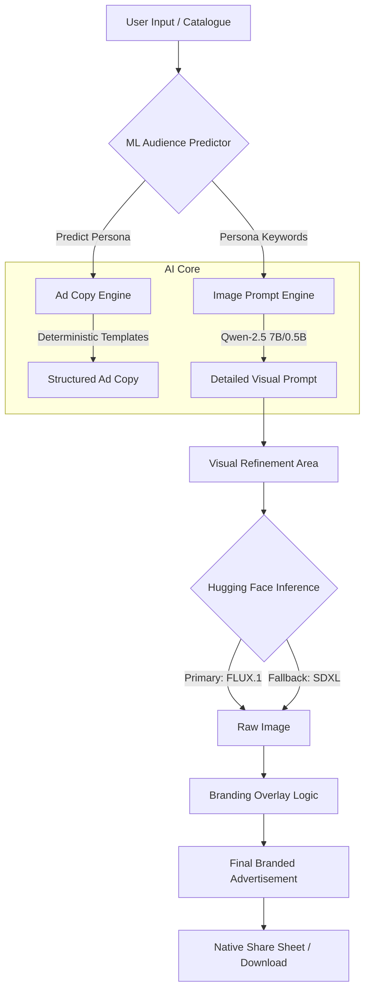

# 🎨 AI Product Ad Composer Studio

**Transform raw products into professional, high-converting branded advertisements in seconds.**

An intelligent, full-stack marketing powerhouse that leverages **Generative AI** (FLUX.1 & Qwen) and **Machine Learning** to create persona-targeted ad copy and ultra-realistic commercial photography from real-world ecommerce data.

---

## 🌟 Key Features

### 🔍 Bulk Ad Scanner (New!)
- **High-Volume Processing**: Upload CSV or Excel files to process hundreds of products at once.
- **Smart Audience Prediction**: Automatically determines the best target demographic for each item in your catalog.
- **Batch Export**: Download all generated ad copies in a single structured spreadsheet.

### ✏️ Manual Ad Creation
- **Limitless Creativity**: Not limited to the pre-loaded dataset—input any product name and description to generate a bespoke ad campaign instantly.
- **Brand Consistency**: Define your Brand Name and Slogan to maintain a unified identity across all creative assets.

### 🤖 Hybrid AI Intelligence
- **✨ Cloud API (Ultra-Performance)**: Uses **Qwen-2.5 7B** for creative, high-fidelity prompt engineering (Fast & Advanced).
- **📉 Local Inference**: Optional support for **Qwen-2.5 0.5B** running on your local hardware for offline privacy.
- **📈 ML Audience Predictor**: Uses a trained **Random Forest** model to analyze product descriptions and predict the ideal buyer persona (Teenagers, Professionals, or Seniors).

### 🖼️ Professional Commercial Visuals
- **High-Fidelity Rendering**: Powered by **FLUX.1 Schnell** for hyper-realistic commercial-grade photography.
- **Smart Fallback System**: Automatically switches to **Stable Diffusion XL** or **SD v1.5** if primary API quotas are exceeded, ensuring zero downtime.
- **📸 Branding Overlay**: Automatically applies a premium semi-transparent branding bar with your logo text and slogan to the final image.

---

## 🔄 How It Works

The AI Ad Composer follows a deterministic multi-stage pipeline to ensure high-quality output:



### The Engineering Bridge:
1.  **Product Selection**: Pulls rich metadata (name, description, category) from the Flipkart E-commerce dataset.
2.  **Persona Scoring**: The **Scikit-Learn** model analyzes keywords to match the product with the most likely buyer.
3.  **Creative Synthesis**: The **Hybrid LLM** translates technical product specs into a creative photography prompt.
4.  **Hardware-Accelerated Branding**: The **Pillow (PIL)** engine applies anti-aliased typography overlays with calculated contrast.

---

## 🛠️ Technology Stack

- **Frontend**: [Streamlit](https://streamlit.io/) (Premium Dark/Light Responsive UI)
- **Text Generation**: [Qwen-2.5](https://huggingface.co/Qwen/Qwen2.5-7B-Instruct) (Hybrid Cloud/Local)
- **Image Generation**: [FLUX.1 Schnell](https://huggingface.co/black-forest-labs/FLUX.1-schnell) (with SDXL support)
- **Machine Learning**: [Scikit-Learn](https://scikit-learn.org/) (Random Forest Classifier)
- **Data Engineering**: [Pandas](https://pandas.pydata.org/) & [Joblib](https://joblib.readthedocs.io/)
- **Image Processing**: [Pillow (PIL)](https://python-pillow.org/) & [Matplotlib](https://matplotlib.org/)

---

## ✨ Advanced UX Features

### 🔧 Interactive Prompt Refinement
Don't settle for the first AI suggestion. The application allows you to edit the **LLM-generated visual prompt** in real-time. Add your own artistic direction (e.g., "add cinematic smoke," "vaporwave colors") before triggering the image model.

### 📋 Native Share Sheet Integration
The ad output isn't just a static image. Use the integrated **Web Share API** button to instantly send your generated ad and custom link to WhatsApp, Instagram, Slack, or LinkedIn directly from your mobile or desktopブラウザ.

### ⚡ Lightning Performance
- **Smart Caching**: Uses `@st.cache_data` and `@st.cache_resource` to ensure the 20,000+ product catalog loads instantly and local LLMs are only initialized once.
- **Session Persistence**: Keeps your ad copy safe while you experiment with different background visuals and prompts.

---

## 🏗️ Project Architecture

```text
Product-Ad-composer/
├── app.py                      # Core Studio & Multi-stage Pipeline
├── requirements.txt            # Project Dependencies
├── .env                        # Private API Configuration
├── .gitignore                  # Development exclusion rules
│
├── notebooks/
│   ├── Personalized_Ad_Composer.ipynb # Data Exploration & ML Research
│   ├── audience_predictor.pkl         # Trained Scikit-Learn Model
│   └── cleaned_product_data.csv       # Pre-processed Product Catalog
│
└── flipkart_com-ecommerce_sample.csv  # Raw Dataset Source
```

---

## ⚡ Quick Start

### 1. Installation
Clone the repository and install the required dependencies:
```bash
git clone https://github.com/dhruvitabrainerhub/Product-Ad-composer.git
cd Product-Ad-composer
pip install -r requirements.txt
```

### 2. API Configuration
Create a `.env` file in the root directory and add your **Hugging Face API Key**:
```bash
HUGGINGFACE_API_KEY=your_hf_token_here
```
> [!TIP]
> Get your free token at [huggingface.co/settings/tokens](https://huggingface.co/settings/tokens). Ensure it has "Read" permissions.

### 3. Launch the Studio
```bash
streamlit run app.py
```

---

## 🚀 Deployment (Streamlit Cloud)

1. Push your code to your GitHub repository.
2. Connect the repo to [share.streamlit.io](https://share.streamlit.io).
3. **Important**: Add your `HUGGINGFACE_API_KEY` to the **Secrets** section in the Streamlit Cloud dashboard:
   ```toml
   HUGGINGFACE_API_KEY = "your_actual_key_here"
   ```

---

## 📜 License
Distributable under the MIT License. See `LICENSE` (if present) for more information.
