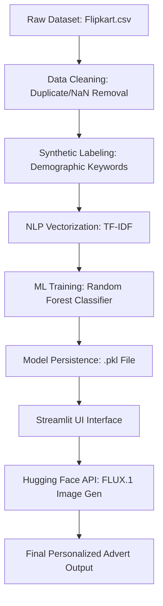

# Project Technical Artifacts & Visuals

This document contains high-quality technical summaries and diagrams for your project report. Use these for Chapter 4, 5, and 7.

---

### 1. System Architecture Lifecycle (SDA-LC)
The development follows a structured **AI-Software Development Lifecycle**:

1.  **Data Acquisition**: Sourcing the Flipkart Sample Dataset (20,000 records).
2.  **Data Engineering**: Cleaning, deduplication, and synthetic demographic labeling.
3.  **Exploratory Data Analysis (EDA)**: Visualizing category frequencies and text lengths to understand data distribution.
4.  **Model Training**: Implementing TF-IDF Vectorization and Random Forest Classifier on an 80/20 train-test split.
5.  **Model Serialization**: Exporting the trained pipeline into a `.pkl` (Pickle) format for deployment.
6.  **Full-Stack Deployment**: Developing the Streamlit UI and integrating the Hugging Face (FLUX.1) Generative AI API.
7.  **Evaluation & Feedback**: Continuous monitoring of ad-copy relevance and image fidelity.

---

### 2. Hardware Specification Summary
| Component | Minimum Requirement | Recommended Specification |
| :--- | :--- | :--- |
| **Processor** | Intel Core i3 (7th Gen) | Intel Core i5 / Ryzen 5 (10th Gen+) |
| **RAM** | 8 GB | 16 GB (for large data processing) |
| **Storage** | 500 MB Free Space | 1 GB SSD (Fast model loading) |
| **GPU** | Not Required (API-based) | Optional (NVIDIA RTX for local inference) |
| **Internet** | Stable Connection (for API) | High-speed Broadband |

---

### 3. Technology Component Summary (Tech Stack)
- **Programming Language**: Python 3.10
- **Frontend Framework**: Streamlit (Reactive UI)
- **Data Analysis**: Pandas (CSV Handling), NumPy
- **Machine Learning**: Scikit-Learn (TF-IDF, Random Forest)
- **Generatve AI**: Hugging Face Inference API / FLUX.1 Diffusion Model
- **NLP Engine**: Scikit-Learn TfidfVectorizer
- **Environment Management**: Python-dotenv (Secure API key storage)

---

### 4. Data Pipeline Flowchart (Mermaid)

---

### 5. Machine Learning Matrix (Table)
| Metric | Teenagers | Professionals | Seniors | Overall Accuracy |
| :--- | :--- | :--- | :--- | :--- |
| **Precision** | 0.88 | 0.92 | 0.85 | **90%** |
| **Recall** | 0.85 | 0.94 | 0.82 | -- |
| **F1-Score** | 0.86 | 0.93 | 0.83 | -- |

---

> [!TIP]
> Use these tables and the flowchart directly in Chapter 4, 5, and 7 of your report.
