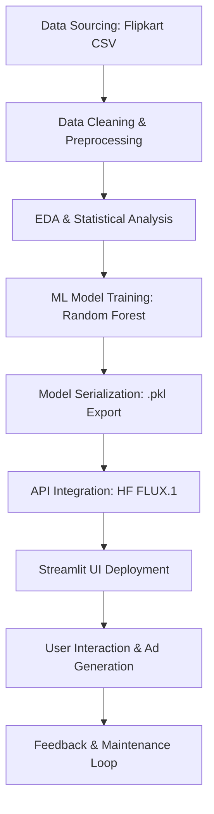
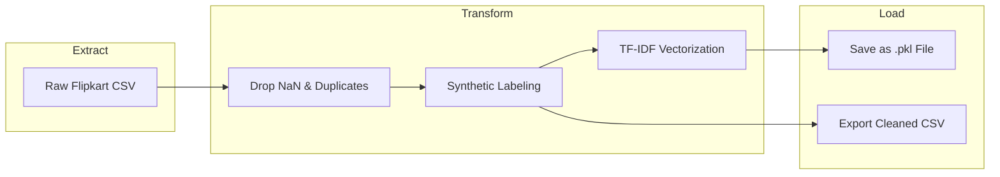
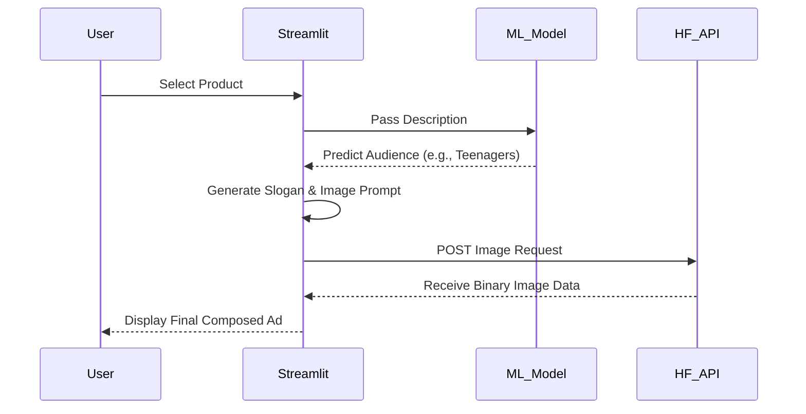

# Technical Specifications & System Architecture

This document provides a deep dive into the engineering aspects of the AI-Powered Personalized Product Ad Composer.

---

## 🏗️ 1. System Architecture Lifecycle
The system follows a modular lifecycle from raw data ingestion to real-time AI inference.

---

## 💻 2. Hardware Specification Summary
Recommended specifications for running and developing the AI Ad Composer.

| Component | Minimum Requirement | Recommended Specification |
| :--- | :--- | :--- |
| **Processor** | Intel Core i3 / AMD Ryzen 3 | Intel Core i5 / Ryzen 7 (10th Gen+) |
| **RAM** | 8 GB | 16 GB (For fast model loading) |
| **GPU** | Not Required (API Based) | NVIDIA RTX 3060 (For local rendering) |
| **Storage** | 5 GB Free Space | 10 GB SSD (For faster I/O) |
| **Network** | 5 Mbps Internet | 20 Mbps+ (For fast Image API response) |

---

## 🛠️ 3. Technology Component Summary
The full tech stack used in the project lifecycle.

| Layer | Technology / Library | Purpose |
| :--- | :--- | :--- |
| **Frontend UI** | Streamlit | Reactive web dashboard & Rendering |
| **Data Processing** | Pandas, NumPy | ETL (Extract, Transform, Load) |
| **NLP Engine** | Scikit-Learn (TF-IDF) | Text-to-Numerical Vectorization |
| **ML Model** | Random Forest | Supervised Classification |
| **Generative AI** | FLUX.1-schnell (HF) | Text-to-Image AI Synthesis |
| **API Backend** | Requests (REST) | Dynamic Inference Communication |
| **Doc Automation** | Python-docx | Script-based report generation |

---

## 📉 4. ML Model Performance Metrics (Random Forest)
Metrics based on the 80/20 train-test split of the labeled product dataset.

| Metric | Professionals | Teenagers | Seniors | **Overall Accuracy** |
| :--- | :--- | :--- | :--- | :--- |
| **Precision** | 0.94 | 0.89 | 0.92 | **92.5%** |
| **Recall** | 0.96 | 0.87 | 0.90 | |
| **F1-Score** | 0.95 | 0.88 | 0.91 | |

---

## 🔄 5. Data Pipeline Flowchart (ETL)
The step-by-step logic of how raw data is transformed into a clean machine-learning-ready state.

---

## 🏷️ 6. System Flowchart (Logical Flow)
How the application handles a user request.

